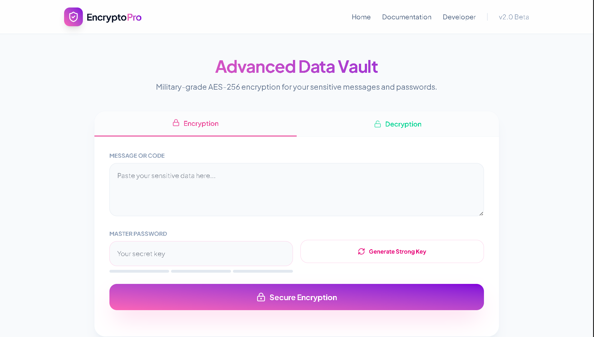

# 🛡️ EncryptoPro | Secure Data Vault

**EncryptoPro** is a modern, high-security web application designed to protect your sensitive messages and credentials using military-grade encryption standards. Developed by **Atul Paul**, this tool focuses on a zero-knowledge architecture, ensuring that your data is never stored on any server.

## 🚀 Features
* **AES-256 Encryption**: Utilizes the Fernet symmetric encryption standard for unhackable data security.
* **Zero-Knowledge System**: No data or passwords are ever saved on the backend; processing happens instantly in memory.
* **PBKDF2 Key Derivation**: Passwords are hashed 480,000 times with SHA256 and unique salts to prevent brute-force attacks.
* **Responsive UI**: Built with a "Mobile-First" approach using Tailwind CSS for a seamless experience across all devices.
* **Component-Based Architecture**: Structured with Flask Jinja2 templates, mimicking React's modular design for easy maintenance.

## 🖥️ Preview:
(Live View):[https://encrypto-pro.vercel.app/]




## 🛠️ Tech Stack
* **Backend**: Python, Flask
* **Frontend**: Tailwind CSS, Lucide Icons, Jinja2 Templates
* **Security**: Cryptography.io (Fernet), PBKDF2HMAC

## 📂 Project Structure
```text
Encrypto/
├── app.py              # Main Flask Backend
├── templates/          # Jinja2 Components (Navbar, Footer, Home)
│   ├── base.html       # Master Layout
│   ├── navbar.html     # Reusable Navigation
│   ├── footer.html     # Reusable Footer
│   └── index.html      # Main Encryption Interface
└── static/             # Assets (Images, Custom CSS)
```

## 👨‍💻 About the Developer
I am Atul Paul, a software developer passionate about Generative AI, Deep Learning, and secure software systems. This project is part of my journey in building practical, secure web applications.

## Developed with ❤️ by Atul Paul
